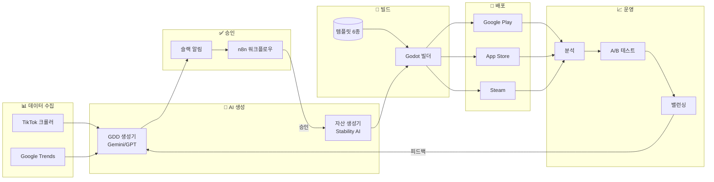

# 🏗️ 아키텍처 개요

## 시스템 흐름도



---

## 모듈 구조

```
core/
├── crawler/           # 트렌드 수집
│   ├── tiktok_crawler.py
│   └── google_trends_crawler.py
│
├── gdd_generator/     # GDD 생성
│   └── gdd_generator.py
│
├── asset_pipeline/    # 이미지 생성
│   └── asset_generator.py
│
├── builder/           # Godot 빌드
│   └── godot_builder.py
│
├── deployer/          # 스토어 배포
│   ├── store_uploader.py    (Google Play)
│   ├── ios_uploader.py      (App Store)
│   └── steam_uploader.py    (Steam)
│
├── orchestrator/      # 워크플로우
│   └── slack_notifier.py
│
├── analytics/         # 분석
│   └── dashboard.py
│
├── ab_testing/        # A/B 테스트
│   └── ab_manager.py
│
├── balancing/         # 밸런싱
│   └── balance_manager.py
│
├── web/               # 웹 대시보드
│   └── dashboard_server.py
│
└── pipeline.py        # 통합 파이프라인
```

---

## 배포 아키텍처

```
┌─────────────────────────────────────────────────┐
│                   Docker Host                    │
├─────────────────────────────────────────────────┤
│  ┌─────────────┐  ┌─────────────┐  ┌─────────┐  │
│  │  Pipeline   │  │    n8n      │  │  Redis  │  │
│  │  :8000      │  │   :5678     │  │  :6379  │  │
│  └─────────────┘  └─────────────┘  └─────────┘  │
└─────────────────────────────────────────────────┘
           │                │
           ▼                ▼
    ┌────────────┐   ┌────────────┐
    │  Slack     │   │  External  │
    │  Webhook   │   │    APIs    │
    └────────────┘   └────────────┘
```
